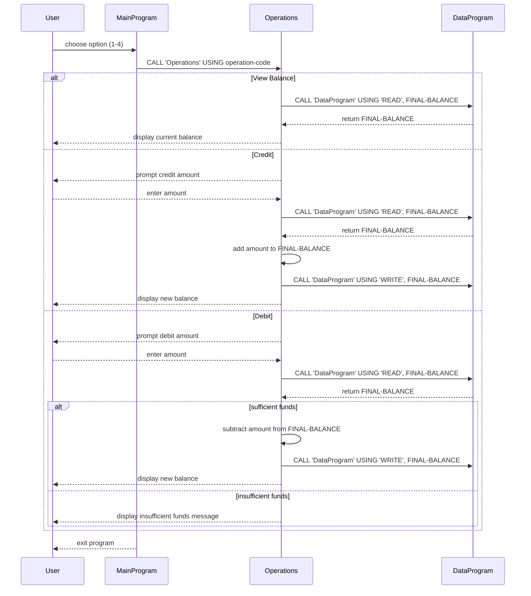

# COBOL Student Account Management Documentation

This repository contains a simple COBOL-based account management example. It models a student account system with basic balance inquiry, credit, and debit operations.

## File Overview

### `src/cobol/main.cob`
- Entry point of the application.
- Displays a console menu for the user to:
  - View balance
  - Credit account
  - Debit account
  - Exit the program
- Accepts user input and calls `Operations` with the selected action.
- Keeps the menu loop running until the user chooses `Exit`.

### `src/cobol/operations.cob`
- Implements the core account operations.
- Receives an operation code from `main.cob` and performs one of:
  - `TOTAL` to read and display the current balance
  - `CREDIT` to prompt for a credit amount and apply it
  - `DEBIT` to prompt for a debit amount and apply it
- On `CREDIT` and `DEBIT`, it reads the current stored balance, updates it, then writes it back via `DataProgram`.
- For `DEBIT`, it checks available funds before subtracting.

### `src/cobol/data.cob`
- Handles the in-memory storage of the account balance.
- Exposes two operations via linkage parameters:
  - `READ`: returns the stored balance
  - `WRITE`: updates the stored balance
- Starts with an initial balance of `1000.00`.

## Key Functions and Flow

1. `MainProgram` displays the menu and dispatches operations.
2. `Operations` interprets the requested action and delegates balance access to `DataProgram`.
3. `DataProgram` manages the stored balance value and keeps the current account state.

## Business Rules for Student Accounts

- Initial account balance is `1000.00`.
- Account holders can:
  - view the current balance
  - credit (deposit) funds
  - debit (withdraw) funds
- Debit operations are only allowed when the account has sufficient funds:
  - if the requested debit amount exceeds the balance, the transaction is rejected and the balance remains unchanged.
- Credit and debit changes persist within the running program by updating the shared balance storage.
- Invalid menu choices prompt a retry.

## Notes

- This example uses COBOL `CALL` statements to separate logic across programs.
- Balance storage is currently in-memory only, so account changes last only for the duration of program execution.

## Sequence Diagram

